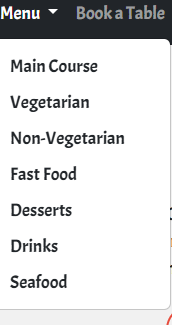

# Food House Restaurant Management System

A real-life restaurant management web application built with Django and Bootstrap 4.  
This project automates and streamlines the management of a restaurant called **Food House**.

---

## 🚀 Features

- **Home Page:** Welcome and introduction to the restaurant.
- **Menu:** Browse the restaurant’s menu.
- **Book a Table:** Reserve a table online.
- **Contact:** Send queries or feedback directly to the owner.
- **Gallery:** View images of the restaurant.
- **User Authentication:** Only signed-in users can contact the owner.
- **Social Login:** Sign in with Google or Facebook.
- **Message Framework:** User-friendly notifications and alerts.
- **And much more!**

---

## 🌐 Live Demo

<!-- Uncomment and add your link if available -->
<!-- [Visit the live site here!](https://127.0.0.1) -->

---

## 🛠️ Built With

- Django
- Bootstrap 4
- Django Message Framework
- django-social-auth

---

## 🛠️ Installation

1. Clone the repository:
   ```
   git clone https://github.com/ANUBHAV0112/Restaurant-website.git
   cd Restaurant-website
   ```
2. Create and activate a virtual environment:
   ```
   python -m venv venv
   # On Windows:
   venv\Scripts\activate
   # On macOS/Linux:
   source venv/bin/activate
   ```
3. Install dependencies:
   ```
   pip install -r requirements.txt
   ```
4. Apply migrations:
   ```
   python manage.py migrate
   ```
5. Run the development server:
   ```
   python manage.py runserver
   ```

---

## 📸 Screenshots

**Home Page**  


**Book a Table**  


**Menu**  


**Veg Menu**  


**Footer**  


**Booking Table Output**  


**Contact Output**  


**Login**  


**Signup**  


**Login & Signup Output**  


**Gallery**  


---

## 🤝 Contributing

Contributions are welcome! Please open an issue or submit a pull request.

---

## 📄 License

This project is licensed under the MIT License.

---

## 👨‍💻 Author

**Anubhav Choudhary**  
[LinkedIn](https://www.linkedin.com/in/anubhav-choudhary-35b8ab254/) | [GitHub](https://github.com/ANUBHAV0112)

---